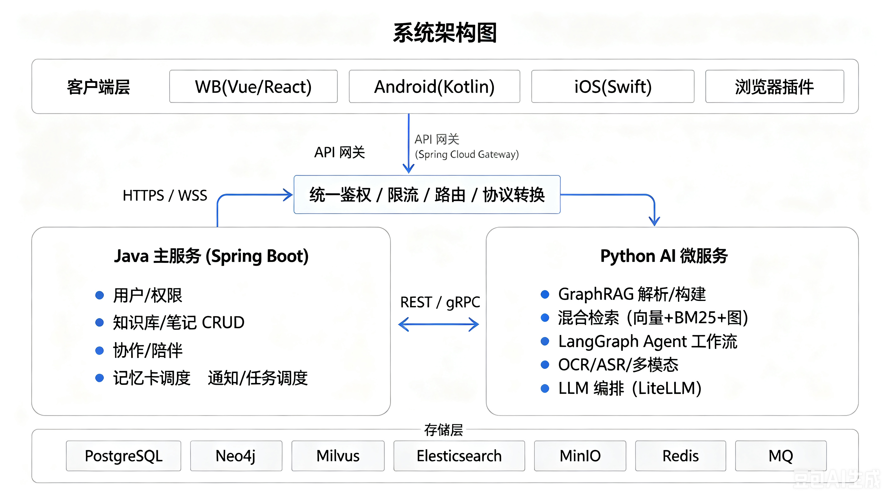

# 个人知识库平台 · 产品设计文档

> 版本：v1.0 | 最后更新：2026-07-13
> 项目代号：AI-Jarvis（个人知识库平台）

---

## 1. 产品概述

### 1.1 产品定位

打造一个个人版本的知识库平台，帮助用户实现知识的**存储、检索、复习、提醒**，以及搭建自己的工作流导出各种文件类型的文档。平台以 **GraphRAG 构建的个人知识图谱为底座**，把「零散笔记」升级为「可推理、可关联、可复习」的结构化知识网络，并通过 Agent 工作流让知识主动为用户服务（提醒、计划、生成、导出）。

### 1.2 目标用户

- 需要长期沉淀知识、追求效率提升的个人学习者、研究者、工程师
- 需要碎片化知识提取整合、经验总结的知识工作者
- 需要相互监督学习、协同整理知识的学习伙伴 / 团队小组

### 1.3 核心价值

| 价值点 | 说明 |
|--------|------|
| 结构化知识网络 | GraphRAG 自动抽取实体与关系，形成可推理的知识图谱 |
| 主动式知识服务 | Agent 工作流 + 记忆曲线，让知识主动提醒、生成、推送 |
| 多端无缝 | Web + Android/iOS 原生 + 浏览器插件，随时录入与查阅 |
| 陪伴与协作 | 陪伴模式互相监督进度，协作模式多人共编知识 |

### 1.4 关键差异化特性

1. **GraphRAG 知识图谱可视化**：不止是搜索，更能看到知识之间的关联路径。
2. **陪伴模式**：学习进度互相可见、互相激励。
3. **协作模式**：细粒度权限的多人实时共编。
4. **Agent 工作流**：Dify 风格的可视化编排，知识 → 行动闭环。

---

## 2. 系统架构总览

### 2.1 总体架构

采用 **Java 主服务（Spring Boot）+ Python AI 微服务** 的混合架构，面向多用户、可私有化部署。



### 2.2 服务拆分与职责

Java 侧保持精简，仅拆分为 **gateway / biz / admin** 三个可独立部署的服务，外加 **common** 公共依赖模块（不独立部署）。所有业务能力（用户、知识库、协作、记忆卡、通知、文件）以「模块」形式收敛在 biz 服务内，避免过度微服务化带来的运维复杂度。AI 能力单独由 Python 服务承载。

| 服务 | 语言/框架 | 核心职责 |
|------|-----------|----------|
| gateway | Spring Cloud Gateway | 路由、鉴权、限流、SSE/WebSocket 透传、协议转换 |
| biz | Spring Boot | 面向 C 端的全部业务：用户/知识库/协作陪伴/记忆卡/通知/文件，模块化组织 |
| admin | Spring Boot | 面向管理端：用户管理、内容审核、系统配置、运营统计、LLM 成本监控 |
| common | Java 依赖库 | 公共实体、异常、工具类、DTO、gRPC 存根、鉴权组件（被 biz/admin 依赖）|
| AI 解析服务 | Python + FastAPI | 文档解析管线、GraphRAG 构建、OCR/ASR |
| AI 检索服务 | Python + FastAPI | 混合检索、重排序、RAG 问答 |
| Agent 引擎服务 | Python + LangGraph | 工作流编排、节点执行、MCP 调用 |

> biz 内部按业务域划分模块（user / knowledge / collaboration / flashcard / notification / file），共享同一进程与数据源，通过应用层解耦；未来某模块压力大时可平滑抽离为独立服务。

### 2.3 服务间通信

- **同步调用**：Java ↔ Python 采用 gRPC（高性能、强类型），对外 REST。
- **流式输出**：AI 问答通过 SSE 从 Python 服务经网关透传到客户端。
- **异步解耦**：文件解析、图谱构建、通知等通过 RocketMQ 事件驱动（事务消息保障一致性）。
- **实时协同**：协作编辑通过 WebSocket + CRDT（Yjs）。

---

## 3. 功能设计

### 3.1 知识存储

**3.1.1 知识库与文档组织**

- 支持创建自定义知识库，每个知识库包含多个文档。
- 知识库类型：手机资源存储型、零碎小计型、个人笔记型、个人日记型、记忆卡型。
- 笔记类型：纯笔记、小记笔记、数据表笔记，后期支持模板（收支记录等）。
- 层级组织：知识库 → 文件夹（资源型/普通型）→ 笔记，最多五层，支持拖拽编辑结构。
- 创建时可自定义名称、类型、描述、标签（tag）。
- **版本管理与回收站**：笔记历史版本（快照 / diff / 回滚），删除进回收站可恢复。
- **双向链接与引用**：`[[笔记名]]` 双向链接、块级引用、自动反向链接列表。
- **智能标签**：AI 自动抽取关键词/实体作为候选标签，支持层级标签与别名合并。
- **收藏、置顶、最近访问**。

**3.1.2 文档解析与导出**

- 统一解析管线：上传 → 类型识别 → 文本抽取（OCR/ASR/多模态）→ 分块 → 向量化 + 实体/关系抽取 → 入向量库/图库，全流程异步（MQ + 任务状态可查）。
- 图片向量化、视频/音频 AI 解析、所有笔记与网站内容走 GraphRAG。
- OCR（PaddleOCR）+ 版面分析，音视频 ASR（Whisper）带时间戳。
- 增量解析：仅对变更块重新向量化与图谱更新。
- 导出：单文档导出为 PDF/PPT/Excel/Word/Markdown（模板化），知识库导出为 zip 或带目录的 PDF。
- 支持扫描 PDF / zip 包转知识库，批量照片上传转笔记，URL 链接解析入库。

**3.1.3 文档编辑**

- 类语雀的 Markdown 块编辑器（类 Notion）：`/` 命令插入代码块、公式（KaTeX）、表格、绘图、思维导图。
- AI 行内辅助：续写、精简、翻译、格式转换、术语解释。
- 离线编辑：移动端离线编辑，恢复网络后增量同步 + 冲突合并。

**3.1.4 记忆卡**

- 笔记批量转记忆卡，支持记忆曲线 / 自定义提醒时间。
- 间隔重复算法（SM-2 / FSRS）：按「熟悉/模糊/不熟悉」动态调整复习间隔。
- AI 自动生成记忆卡（填空/简答/是非题），特定文件夹持续生成。
- 状态标记（已/未提醒、已/未学习、掌握程度），记忆统计看板（热力图、掌握率趋势）。

### 3.2 AI 小助与检索

- **混合检索**：稠密向量 + BM25（ES）+ 图谱多跳，RRF 融合重排序。
- **RAG 问答**：基于用户知识库回答，提供原文出处引用。
- **多文档综合分析**：跨文档归纳、对比、生成综述报告（输出为新笔记）。
- **对话式入库**：一键将 AI 回答另存为笔记，对话历史可索引。
- **MCP 工具**：定时提醒、短信/邮件通知等。
- **计划制定**：引用笔记/知识库，AI 制定并设置提醒计划。
- **学习模式**：推荐相关文档与问题，支持学习与复习。
- **主动推送（Daily Brief）**：每日汇总待复习卡 + 知识更新 + 计划提醒。
- **知识盲区发现**：基于图谱分析知识结构薄弱连接，推荐关联知识。

### 3.3 知识图谱可视化

- 图谱总览（力导向图，实体按类型着色）、局部展开（多跳邻居）。
- 时间轴视图、聚类视图（识别知识孤岛）、路径查询（两概念间关联路径解释）。

### 3.4 Agent 工作流

- Dify 风格图编辑器配置工作流，节点自定义功能（执行时间、Skill、MCP 调用）。
- 条件分支、循环、自然语言解析节点配置。
- 工作流模板市场、事件触发（笔记新增/更新、标签命中、记忆卡到期）。
- 工作流调试与日志（执行历史、输入输出、错误重试）。

### 3.5 陪伴模式与协作模式（核心新增）

**3.5.1 陪伴模式（Companion Mode）**

- 账户所有者可邀请他人以「陪伴者」身份进入其知识库。
- 陪伴者可查看所有者的**学习进度**（记忆卡掌握率、复习完成情况、知识增长）。
- 所有者完成进度时，**自动推送通知**给陪伴者（互相监督激励）。
- 陪伴者可对所有者的笔记进行**评论**。
- 所有者可为陪伴者授予**只读**或**编辑**权限。

**3.5.2 协作模式（Collaboration Mode）**

- 笔记/知识库所有者可邀请协作者，授予**细粒度权限**：只读、编辑、删除。
- 权限粒度可到知识库级、文件夹级、单笔记级。
- **多人实时共编**：基于 CRDT（Yjs）双方可同时编辑同一文档，实时同步光标与内容。
- **评论与批注**：段落级评论、@提及、评论解决状态。
- **变更可见性**：协同编辑历史、谁改了什么（operation log）。

**3.5.3 权限模型**

| 角色 | 查看进度 | 查看笔记 | 评论 | 编辑 | 删除 | 管理协作者 |
|------|:--:|:--:|:--:|:--:|:--:|:--:|
| 所有者 Owner | ✓ | ✓ | ✓ | ✓ | ✓ | ✓ |
| 编辑者 Editor | ✓ | ✓ | ✓ | ✓ | ✗ | ✗ |
| 陪伴者 Companion | ✓ | ✓ | ✓ | 可授予 | ✗ | ✗ |
| 只读者 Viewer | 可授予 | ✓ | ✓ | ✗ | ✗ | ✗ |

### 3.6 其他

- 传统应用特性：加密上传、鉴权登录、用户注册、用户管理。
- 浏览器插件剪藏、移动端快捷输入（Quick Capture）。
- 统计仪表盘、学习热力图、AI 周报。
- 分享与社区（后期）：只读分享链接、知识名片、知识订阅。

---

## 4. 技术选型

### 4.1 后端（Java 主服务）

| 组件 | 技术选型 | 说明 |
|------|---------|------|
| 主框架 | Spring Boot 3.x + Spring WebFlux | 响应式，支持 SSE 流式 AI 输出 |
| 微服务注册 | Spring Cloud Alibaba Nacos | 服务发现与配置中心 |
| API 网关 | Spring Cloud Gateway | 路由、限流、鉴权、协议转换 |
| 认证授权 | Spring Security + JWT + OAuth2 | 支持微信/Google 第三方登录 |
| 服务间通信 | gRPC（Java ↔ Python）| 强类型、高性能 |
| 任务调度 | XXL-Job | 分布式定时任务（提醒、日报、工作流触发）|
| 消息队列 | RocketMQ | 文件解析异步化、事件驱动，事务消息保障一致性 |
| 协同编辑 | WebSocket + Yjs CRDT | 实时多人共编 |
| 构建工具 | Maven / Gradle | |

### 4.2 AI / RAG 层（Python 微服务）

| 功能 | 技术选型 | 说明 |
|------|---------|------|
| 服务框架 | FastAPI + Uvicorn | 高性能异步 API |
| GraphRAG | Microsoft GraphRAG / LlamaIndex Property Graph | 实体/关系抽取，社区摘要，多跳推理 |
| Agent 工作流 | LangGraph | 有状态工作流编排，支持循环/条件 |
| LLM 统一调用 | LiteLLM | 支持 OpenAI/Claude/Qwen/本地模型切换 |
| 向量嵌入 | BGE-M3 / text-embedding-3-small | 中英文，支持稠密+稀疏双模 |
| 文本分块 | LangChain + 语义分块 | 按语义边界分块 |
| 重排序 | BGE-Reranker / Cohere Rerank | 混合检索结果精排 |
| OCR | PaddleOCR | 中文扫描件识别 |
| ASR | OpenAI Whisper（本地/API）| 音视频转写带时间戳 |
| 多模态 | GPT-4o / Qwen-VL | 图片内容理解、图表解析 |
| 向量检索 SDK | qdrant-client | |

### 4.3 存储层

| 用途 | 技术选型 | 说明 |
|------|---------|------|
| 关系数据（主） | PostgreSQL 16 | 用户、知识库、笔记元数据、权限、陪伴关系 |
| 知识图谱 | Neo4j | 实体节点、关系边，支持 Cypher 多跳查询 |
| 向量数据库 | Qdrant | 语义向量检索，metadata 过滤，支持稠密+稀疏混合检索 |
| 全文检索 | Elasticsearch 8.x | BM25 + 中文分词（ik_analyzer）|
| 对象存储 | MinIO（私有化）/ 阿里云 OSS | 图片、视频、音频、原始文件 |
| 缓存 | Redis 7 | 会话、热点数据、分布式锁、记忆卡调度状态 |
| 消息队列 | RocketMQ | 解析任务、通知事件，事务消息 |

### 4.4 前端（Web）

| 用途 | 技术选型 |
|------|---------|
| 框架 | Vue 3 + Vite（或 React + Next.js）|
| 块编辑器 | Tiptap（ProseMirror 封装）|
| 知识图谱可视化 | AntV G6 |
| UI 组件库 | Arco Design |
| 状态管理 | Pinia |
| 实时通信 | SSE（AI 流输出）+ WebSocket（协同编辑）|
| 协同 CRDT | Yjs + y-websocket |
| PWA | Service Worker + IndexedDB 离线支持 |

### 4.5 移动端

| 平台 | 技术选型 | 说明 |
|------|---------|------|
| Android | Java + XML 原生 | 原生开发，深度调用相机/相册/通知/离线 |
| iOS | Swift + SwiftUI | 原生开发，深度系统集成 |
| 离线同步（Android）| Room + 增量同步协议 | 离线编辑，后台同步 |
| 离线同步（iOS）| Core Data + 增量同步协议 | |
| 推送通知 | FCM（Android）/ APNs（iOS）| 记忆卡、计划、陪伴进度推送 |
| 端侧 AI（可选）| TFLite / Core ML | 离线轻量标签分类 |

### 4.6 基础设施

| 组件 | 技术选型 |
|------|---------|
| 容器化 | Docker + Docker Compose（开发）/ Kubernetes（生产）|
| CI/CD | GitHub Actions |
| 监控 | Prometheus + Grafana + Loki（日志）|
| 链路追踪 | OpenTelemetry + Jaeger |
| 私有化部署 | Docker Compose 一键启动 |

---

## 5. 后端架构设计

### 5.1 模块划分

Java 后端采用 **单仓库（Monorepo）多模块** 结构，gateway / biz / admin 独立打包部署，common 作为共享依赖。

```
ai-jarvis-backend/
├── common/                 # 公共依赖（不独立部署）
│   ├── entity/             # 基础实体、枚举、常量
│   ├── exception/          # 统一异常体系
│   ├── utils/              # 工具类
│   ├── security/           # JWT 解析、鉴权注解
│   └── grpc-stub/          # gRPC 存根（调用 Python 服务）
│
├── gateway/                # API 网关（Spring Cloud Gateway）
│   ├── filter/             # 全局鉴权过滤器、限流过滤器
│   ├── route/              # 路由配置
│   └── config/             # 网关全局配置
│
├── biz/                    # C 端核心业务服务（Spring Boot）
│   ├── module-user/        # 用户注册/登录/OAuth/Profile
│   ├── module-knowledge/   # 知识库/文件夹/笔记/版本/双向链接/标签
│   ├── module-collab/      # 陪伴模式/协作权限/评论/CRDT WebSocket
│   ├── module-flashcard/   # 记忆卡/间隔重复(SM-2/FSRS)/调度
│   ├── module-notification/# 通知调度/计划/FCM/APNs/邮件/Daily Brief
│   ├── module-file/        # 文件上传/加密/对象存储/导出
│   └── module-ai/          # AI 代理（gRPC 调 Python，SSE 透传）
│
└── admin/                  # 管理端服务（Spring Boot）
    ├── user/               # 用户管理、封禁、角色
    ├── content/            # 内容审核
    ├── system/             # 系统配置、LLM Key 管理
    └── statistics/         # 运营统计、LLM Token 成本监控
```

### 5.2 数据库核心表设计

**用户与权限**

```sql
-- 用户表
CREATE TABLE t_user (
    id          BIGINT PRIMARY KEY,
    username    VARCHAR(64) UNIQUE NOT NULL,
    email       VARCHAR(128) UNIQUE,
    password    VARCHAR(256),           -- BCrypt 加密
    avatar_url  VARCHAR(512),
    status      SMALLINT DEFAULT 1,    -- 1:正常 0:封禁
    created_at  TIMESTAMP,
    updated_at  TIMESTAMP
);

-- 陪伴/协作关系表
CREATE TABLE t_collaboration (
    id              BIGINT PRIMARY KEY,
    resource_type   VARCHAR(16) NOT NULL,   -- LIBRARY/FOLDER/NOTE
    resource_id     BIGINT NOT NULL,
    owner_id        BIGINT NOT NULL,
    collaborator_id BIGINT NOT NULL,
    role            VARCHAR(16) NOT NULL,   -- OWNER/EDITOR/COMPANION/VIEWER
    can_view_progress BOOLEAN DEFAULT FALSE,
    created_at      TIMESTAMP
);
```

**知识库**

```sql
-- 知识库表
CREATE TABLE t_library (
    id          BIGINT PRIMARY KEY,
    user_id     BIGINT NOT NULL,
    name        VARCHAR(256) NOT NULL,
    type        VARCHAR(32) NOT NULL,    -- RESOURCE/SCRATCH/NOTE/DIARY/FLASHCARD
    description TEXT,
    is_deleted  BOOLEAN DEFAULT FALSE,
    created_at  TIMESTAMP,
    updated_at  TIMESTAMP
);

-- 笔记表
CREATE TABLE t_note (
    id          BIGINT PRIMARY KEY,
    library_id  BIGINT NOT NULL,
    parent_id   BIGINT,                 -- 父文件夹，NULL 则直属知识库
    user_id     BIGINT NOT NULL,
    title       VARCHAR(512),
    content     TEXT,                   -- 块编辑器 JSON
    note_type   VARCHAR(16),            -- NOTE/SCRATCH/TABLE/RESOURCE
    sort_order  INT DEFAULT 0,
    version     INT DEFAULT 1,
    is_deleted  BOOLEAN DEFAULT FALSE,
    created_at  TIMESTAMP,
    updated_at  TIMESTAMP
);

-- 笔记版本表
CREATE TABLE t_note_version (
    id          BIGINT PRIMARY KEY,
    note_id     BIGINT NOT NULL,
    version     INT NOT NULL,
    content     TEXT,
    created_by  BIGINT,
    created_at  TIMESTAMP
);
```

### 5.3 核心服务接口（REST）

**知识库服务**

```
POST   /api/v1/libraries                  创建知识库
GET    /api/v1/libraries                  查询我的知识库列表
GET    /api/v1/libraries/{id}/tree        获取知识库目录树
POST   /api/v1/notes                      创建笔记
PUT    /api/v1/notes/{id}                 更新笔记（触发增量解析事件）
GET    /api/v1/notes/{id}/versions        获取历史版本
POST   /api/v1/notes/{id}/restore/{ver}  回滚到指定版本
DELETE /api/v1/notes/{id}                 软删除（进回收站）
POST   /api/v1/tree/move                  拖拽移动节点
```

**协作服务**

```
POST   /api/v1/collaboration/invite       邀请协作者
PUT    /api/v1/collaboration/{id}/role    修改协作者权限
GET    /api/v1/companion/{userId}/progress 查看陪伴者学习进度
POST   /api/v1/notes/{id}/comments        发表评论
WS     /ws/collab/{noteId}               协同编辑 WebSocket
```

**AI 代理（透传 Python 微服务）**

```
POST   /api/v1/ai/chat                   RAG 问答（SSE 流式）
POST   /api/v1/ai/search                 混合检索
POST   /api/v1/ai/graph/query            图谱路径查询
POST   /api/v1/ai/flashcard/generate     AI 生成记忆卡
```

### 5.4 文件解析异步管线

```
1. 客户端上传文件 → module-file 存入 MinIO，发布 FILE_UPLOADED 事件（RocketMQ）
2. AI 解析服务消费事件 → 类型识别（PDF/图片/音频/视频/文本）
3. 文本抽取（PDFMiner/PaddleOCR/Whisper/多模态 VLM）
4. 文本分块（语义分块，chunk_size 可配）
5. 向量化 → 写入 Qdrant（collection 按 user_id 隔离）
6. 实体/关系抽取（GraphRAG）→ 写入 Neo4j
7. 全文写入 Elasticsearch
8. 发布 PARSE_DONE 事件（RocketMQ）→ module-knowledge 更新解析状态
9. 客户端轮询或 WebSocket 推送解析完成通知
```

### 5.5 安全设计

- **传输**：全站 HTTPS / TLS 1.3
- **存储**：MinIO SSE-S3 服务端加密，可选客户端加密（端到端）
- **认证**：JWT（Access 2h + Refresh 30d，Redis 维护黑名单）
- **权限**：RBAC + 资源级 ACL（每次操作检查 t_collaboration 表权限）
- **Prompt 安全**：用户输入过滤 Prompt Injection，输出内容安全审核
- **Rate Limiting**：网关层对 AI 接口单独限流（防止成本暴增）
- **数据隔离**：向量库/图库 namespace 严格按 user_id 隔离

---

## 6. 前端架构设计（Web）

### 6.1 目录结构

```
ai-jarvis-web/
├── src/
│   ├── api/              # 接口封装（按服务分文件）
│   ├── assets/           # 静态资源
│   ├── components/       # 通用组件（编辑器、图谱、卡片等）
│   │   ├── editor/       # Tiptap 块编辑器封装
│   │   ├── graph/        # AntV G6 知识图谱组件
│   │   └── collab/       # 协同编辑相关组件
│   ├── layouts/          # 布局（侧边栏/主内容区/设置）
│   ├── pages/            # 路由页面
│   │   ├── library/      # 知识库页面
│   │   ├── note/         # 笔记编辑页面
│   │   ├── graph/        # 知识图谱页面
│   │   ├── flashcard/    # 记忆卡页面
│   │   ├── ai-chat/      # AI 小助页面
│   │   ├── agent/        # Agent 工作流编辑器
│   │   ├── companion/    # 陪伴/协作管理页面
│   │   └── settings/     # 用户设置
│   ├── stores/           # Pinia 状态管理
│   ├── composables/      # 可复用逻辑（useCollab、useGraph 等）
│   ├── workers/          # Web Worker（离线 IndexedDB 操作）
│   └── utils/            # 工具函数
├── public/
│   └── sw.js             # Service Worker（PWA 离线缓存）
└── vite.config.ts
```

### 6.2 核心模块说明

**块编辑器（Tiptap）**

- 基于 ProseMirror，支持协同扩展（TiptapCollaboration）
- 自定义节点：代码块（带语法高亮）、公式（KaTeX）、双向链接（`[[]]`）、图片/视频嵌入、思维导图
- AI 行内辅助：选中文本浮层，调用 AI 接口，结果流式插入
- 离线支持：内容变更写入 IndexedDB，联网后增量同步

**协同编辑（Yjs + WebSocket）**

```
客户端 A ──┐
           ├──► WebSocket ──► collaboration-service ──► 广播给 B
客户端 B ──┘                  （Yjs 文档状态同步）
```

- 使用 `y-websocket` 连接服务端 Yjs provider
- 光标感知（awareness）显示其他用户实时光标位置与颜色
- 离线时本地 Yjs Doc 继续编辑，重连后自动 merge

**知识图谱（AntV G6）**

- 总览视图：全库力导向图，支持节点点击展开/折叠
- 局部视图：从任一笔记出发，可视化展开多跳邻居
- 路径高亮：输入两个概念，高亮路径节点与边
- 右键菜单：跳转笔记、添加关系、查看节点详情

**Agent 工作流编辑器**

- 基于 Vue Flow（或 React Flow）的画布式节点编辑
- 拖拽添加节点、连线、配置节点属性
- 支持条件分支（菱形节点）、循环节点
- 节点自然语言配置：输入描述自动解析为节点配置 JSON
- 工作流调试面板：实时展示节点执行状态与输出

### 6.3 性能策略

- 大文档虚拟滚动（VList）
- 知识图谱节点过多时自动聚类显示（超过 500 节点走后端聚类）
- IndexedDB 缓存笔记内容（首屏秒开）
- SSE 流式 AI 回答逐 token 渲染

---

## 7. App 端架构设计

### 7.1 Android（Java + XML 原生）

**模块划分**

```
app/
├── core/
│   ├── network/          # Retrofit2 + OkHttp3（含 SSE EventSource 支持）
│   ├── database/         # Room（SQLite 离线存储）
│   ├── sync/             # 增量同步引擎（SyncService）
│   └── push/             # FCM 推送接收与处理
├── ui/
│   ├── auth/             # 登录/注册（Activity + Fragment + XML 布局）
│   ├── library/          # 知识库/文件夹/笔记列表（RecyclerView）
│   ├── editor/           # Markdown 编辑器（WebView 嵌入或自定义 EditText 扩展）
│   ├── flashcard/        # 记忆卡复习（翻转动画、进度统计）
│   ├── ai_chat/          # AI 小助（SSE 流式逐字输出）
│   ├── graph/            # 知识图谱（WebView 嵌入 AntV G6）
│   ├── companion/        # 陪伴/协作管理页面
│   ├── capture/          # 快捷输入（悬浮窗 Service）
│   └── settings/         # 设置页面
├── widget/               # 主屏 AppWidget（Quick Capture）
├── service/              # 后台同步 IntentService / JobIntentService
└── receiver/             # 广播接收（推送通知、网络变化触发同步）
```

**离线同步机制**

```
编辑笔记 → 写入 Room（本地） → 标记 sync_status=PENDING
SyncService（JobScheduler / WorkManager 触发）
  ├── 有网络 → 增量上传 PENDING 记录（携带 version + last_sync_at）
  ├── 服务端检测冲突 → 返回 conflict=true → AlertDialog 让用户选择保留版本
  └── 成功后更新 sync_status=SYNCED + 更新本地 version
```

**核心技术点**

- MVP / MVVM 架构（ViewModel + LiveData），XML 布局
- RecyclerView + DiffUtil 高效列表渲染
- Camera2 / CameraX API 拍照上传，相册批量选择（MediaStore）
- WorkManager / JobScheduler 后台定时同步与提醒任务触发
- WebView 承载知识图谱（AntV G6）与富文本编辑器，通过 JavascriptInterface 与 Java 层通信
- ProGuard 混淆 + 网络层 HTTPS Pinning 防逆向

### 7.2 iOS（Swift + SwiftUI）

**模块划分**

```
AIJarvis.xcodeproj/
├── Core/
│   ├── Network/          # URLSession + Alamofire
│   ├── Persistence/      # Core Data（离线存储）
│   ├── Sync/             # 增量同步引擎
│   └── Push/             # APNs 推送处理
├── Features/
│   ├── Auth/
│   ├── Library/
│   ├── Editor/           # 富文本编辑器（TextKit 2）
│   ├── Flashcard/
│   ├── AIChat/           # SSE 流式输出
│   ├── Graph/            # 知识图谱（WKWebView 嵌入 G6）
│   ├── Companion/
│   └── Settings/
├── Widgets/              # iOS 小组件（Quick Capture）
└── Intents/              # Siri 快捷指令（快速记录）
```

**核心技术点**

- SwiftUI + Combine 响应式 UI
- Core Data + CloudKit 本地持久化（可选 iCloud 备份）
- BackgroundTasks 后台同步
- Share Extension 从其他 App 快速剪藏到知识库
- Siri Shortcuts：语音快捷记录碎片想法

### 7.3 双端通用设计约定

- API 版本化：客户端携带 `X-App-Version`，后端做兼容降级
- 增量同步协议：基于 `updated_at + version` 的差量拉取
- 推送策略：优先 WebSocket 实时推送（在线），降级 FCM/APNs（后台）
- 图片上传：先压缩（WebP）再上传，返回 CDN URL
- 安全：所有 API 请求携带 JWT，敏感本地数据（Token）存 Keychain/Keystore

---

## 8. Python AI 微服务架构设计

### 8.1 服务划分

```
ai-jarvis-ai/
├── parse-service/        # 文档解析（OCR/ASR/分块/向量化/GraphRAG）
├── search-service/       # 混合检索（向量+BM25+图谱+重排序）
├── chat-service/         # RAG 问答（SSE 流式）
└── agent-service/        # LangGraph Agent 工作流引擎
```

### 8.2 文档解析服务（parse-service）

```python
# 解析管线伪代码
async def process_document(file_id: str, file_type: str):
    # 1. 从 MinIO 下载文件
    raw = await minio.get(file_id)
    # 2. 文本抽取
    text = await extract_text(raw, file_type)   # OCR/ASR/PDFMiner
    # 3. 语义分块
    chunks = semantic_chunker.split(text)
    # 4. 向量化（并发批量）
    embeddings = await embedder.embed_batch(chunks)
    # 5. 写入向量库（Qdrant）
    await qdrant.insert(user_id, chunks, embeddings)
    # 6. 写入全文索引（ES）
    await es.bulk_index(user_id, chunks)
    # 7. GraphRAG 实体/关系抽取 → Neo4j
    await graphrag.extract_and_store(text, user_id)
    # 8. 通知 Java 主服务解析完成（RocketMQ）
    await rocketmq.publish("PARSE_DONE", {"file_id": file_id})
```

### 8.3 混合检索服务（search-service）

```
用户查询
    │
    ├─► 向量检索（Qdrant）       ─┐
    ├─► BM25 全文检索（ES）       ├─► RRF 融合 ─► BGE-Reranker 精排 ─► Top-K 结果
    └─► 图谱多跳查询（Neo4j）    ─┘
```

- 三路检索并发执行，RRF（Reciprocal Rank Fusion）融合排序
- BGE-Reranker 对 Top-20 精排取 Top-5 作为 RAG 上下文
- 所有检索结果按 user_id namespace 严格过滤

### 8.4 RAG 问答服务（chat-service）

- 检索召回 Top-K 上下文块（附带 note_id / chunk_id 引用信息）
- 拼装 Prompt（System：知识库摘要 + 用户身份，User：问题 + 上下文）
- LiteLLM 调用 LLM，流式返回（SSE）
- 引用溯源：输出中标注来源 [文档名#章节]，支持点击跳转原文

### 8.5 Agent 工作流引擎（agent-service）

```python
# 基于 LangGraph 的工作流状态机
from langgraph.graph import StateGraph

def build_workflow(config: WorkflowConfig) -> StateGraph:
    graph = StateGraph(WorkflowState)
    for node in config.nodes:
        graph.add_node(node.id, node_executor(node))
    for edge in config.edges:
        if edge.is_conditional:
            graph.add_conditional_edges(edge.from_id, edge.condition_fn)
        else:
            graph.add_edge(edge.from_id, edge.to_id)
    return graph.compile()
```

- 节点类型：LLM 节点、检索节点、MCP 工具节点、条件判断节点、循环节点
- 工作流配置存储在 PostgreSQL，运行时从 Java 服务加载
- 执行日志写入 Redis，供前端实时轮询工作流状态

---

## 9. 非功能需求

### 9.1 性能指标

| 指标 | 目标值 |
|------|--------|
| 笔记页面首屏加载 | < 1.5s（有缓存 < 0.5s）|
| AI 问答首 token 延迟 | < 2s |
| 向量检索 P99 | < 200ms |
| 全文检索 P99 | < 100ms |
| 协同编辑同步延迟 | < 300ms |
| 文件解析（5MB PDF）| < 60s（异步，不阻塞用户）|

### 9.2 安全性

- 全站 HTTPS / TLS 1.3
- 密码 BCrypt 存储，JWT 双 Token 机制，Redis 黑名单
- 资源级 ACL 权限校验
- Prompt Injection 检测与过滤
- AI 接口 Rate Limiting（按用户每分钟 Token 消耗上限）
- MinIO 服务端加密，敏感文件可选端到端加密
- 账号注销支持数据彻底删除（GDPR/个保法合规）

### 9.3 可用性

- 文档解析全异步，上传即返回任务 ID，不阻塞
- 移动端核心页面离线可用（Room/Core Data + IndexedDB 缓存）
- 数据库主从复制，Redis Sentinel，MinIO 多节点

### 9.4 可观测性

- OpenTelemetry 全链路 Trace（Java + Python 统一 TraceID）
- Prometheus + Grafana 监控（服务健康、QPS、延迟、LLM Token 消耗）
- Loki 日志聚合
- LLM 调用成本统计与预警（按用户/按工作流分别统计 Token 消耗）

---

## 10. 开发计划

### Phase 1 — 核心 MVP（基础可用）

**目标**：用户可以注册登录、管理知识库笔记、基础 RAG 问答，Android 端可用。

| 模块 | 核心任务 |
|------|---------|
| 后端：用户中心 | 注册/登录（密码+JWT）、用户信息管理、OAuth 接入（微信/Google）|
| 后端：知识库服务 | 知识库/文件夹/笔记 CRUD、拖拽排序、软删除/回收站 |
| 后端：文件服务 | 文件上传（MinIO）、加密、任务状态查询 |
| Python：解析服务 | 文本文件解析管线（PDF/Markdown/TXT）、向量化（BGE-M3）、ES 全文索引 |
| Python：检索服务 | 基础向量检索 + BM25 检索，RAG 问答（LiteLLM + GPT-4o/Qwen）|
| 前端：Web | 登录注册、知识库目录树、Tiptap 基础编辑器、AI 问答页（SSE）|
| App：Android | 登录、知识库/笔记列表、Markdown 编辑、AI 问答（SSE）|
| 基础设施 | Docker Compose 本地开发环境、PostgreSQL/Redis/Milvus/ES/MinIO 启动脚本 |

---

### Phase 2 — GraphRAG & 知识图谱

**目标**：GraphRAG 接入，知识图谱可视化，混合检索，双向链接，记忆卡。

| 模块 | 核心任务 |
|------|---------|
| Python：解析服务 | GraphRAG 实体/关系抽取 + Neo4j 入库、增量解析 |
| Python：检索服务 | 混合检索（向量+BM25+图谱 RRF）、BGE-Reranker 精排 |
| 后端：知识库服务 | 双向链接（`[[]]` 解析 + 反向链接表）、版本管理、智能标签 |
| 后端：记忆卡服务 | 记忆卡 CRUD、SM-2 间隔重复调度、AI 自动生成记忆卡 |
| 前端：Web | 知识图谱可视化（AntV G6）、记忆卡页面、双向链接悬浮预览 |
| App：Android | 记忆卡复习、离线编辑 + 同步（Room + WorkManager）|
| App：iOS（启动）| 项目搭建，登录/笔记基础功能 |

---

### Phase 3 — 陪伴协作 & Agent 工作流

**目标**：陪伴/协作模式上线，多人实时协同编辑，LangGraph Agent 工作流可用。

| 模块 | 核心任务 |
|------|---------|
| 后端：协作服务 | 邀请协作者、RBAC+ACL 权限模型、评论、进度推送（WebSocket）|
| 后端：协作服务 | Yjs CRDT WebSocket 服务、冲突处理 |
| 后端：通知服务 | FCM/APNs 推送、陪伴进度通知、计划提醒、记忆卡到期通知 |
| Python：Agent 服务 | LangGraph 工作流引擎、节点类型实现、MCP 工具集成 |
| 前端：Web | 协同编辑（Yjs + TiptapCollaboration）、Agent 图编辑器（Vue Flow）|
| 前端：Web | 陪伴/协作管理页面、进度看板 |
| App：Android | 协同编辑、陪伴进度查看、推送通知处理 |
| App：iOS | 协同编辑、陪伴功能、APNs 推送 |

---

### Phase 4 — 智能化增强

**目标**：Daily Brief 主动推送、知识盲区发现、AI 多文档综合分析、统计洞察。

| 模块 | 核心任务 |
|------|---------|
| 后端：通知服务 | Daily Brief 定时生成（XXL-Job）、主动推送 |
| Python：检索/问答 | 多文档综合分析（跨文档 RAG）、知识盲区发现（图谱弱连接分析）|
| 后端：知识库服务 | AI 周报生成、学习统计仪表盘数据 API |
| 前端：Web | 统计仪表盘（热力图、掌握率趋势、词云）、AI 行内辅助（编辑器浮层）|
| App：Android/iOS | Daily Brief 卡片、Quick Capture 小组件 |

---

### Phase 5 — 多端完善 & 社区

**目标**：浏览器插件、iOS 完整功能、分享/知识名片、私有化部署。

| 模块 | 核心任务 |
|------|---------|
| 浏览器插件 | 网页正文提取（Readability）、一键剪藏、自动触发 GraphRAG 解析 |
| App：iOS | 完整功能对齐 Android、Share Extension、Siri Shortcuts |
| 后端：分享服务 | 只读分享链接（设有效期/密码）、知识名片公开页 |
| 基础设施 | Kubernetes 部署配置、Docker Compose 一键私有化部署包、监控告警完善 |

---

## 11. 各模块核心任务总结

| 模块 | 核心任务 | 关键技术 |
|------|---------|---------|
| API 网关 | 路由/限流/鉴权/SSE 透传 | Spring Cloud Gateway |
| 用户中心 | 注册/登录/OAuth/RBAC | Spring Security + JWT |
| 知识库服务 | CRUD/版本/双向链接/智能标签 | PostgreSQL + Redis |
| 协作服务 | 权限模型/实时协同/评论/进度推送 | Yjs + WebSocket |
| 记忆卡服务 | 间隔重复调度/AI 生成/状态管理 | XXL-Job + LiteLLM |
| 通知服务 | 定时/事件触发/FCM/APNs/Daily Brief | XXL-Job + RocketMQ |
| 文件服务 | 加密上传/对象存储/导出模板 | MinIO + RocketMQ |
| AI 解析服务 | OCR/ASR/分块/向量化/GraphRAG | PaddleOCR + Whisper + GraphRAG |
| AI 检索服务 | 混合检索/重排序/RAG 问答 | Qdrant + ES + Neo4j + BGE |
| Agent 引擎 | 工作流编排/节点执行/MCP | LangGraph + LiteLLM |
| Web 前端 | 块编辑器/图谱/Agent 画布/协同 | Vue3 + Tiptap + G6 + Yjs |
| Android | 原生/离线同步/Quick Capture | Java + XML + Room |
| iOS | 原生/Share Extension/Siri | Swift + SwiftUI + Core Data |
