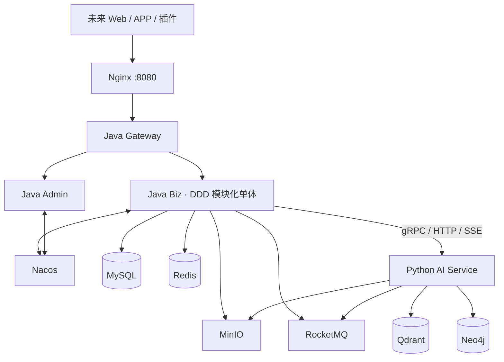
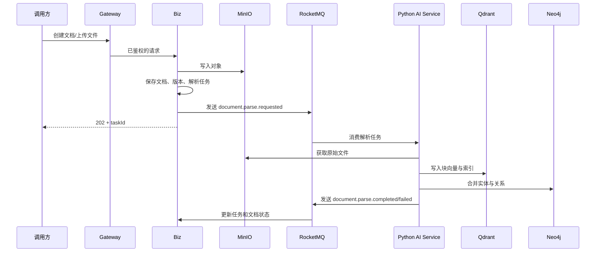
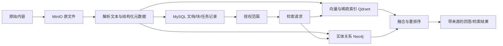

# 个人知识库平台 · 服务端开发设计文档

> 项目代号：NoteGather（个人知识库平台）
>
> 版本：v1.1（服务端开发版）｜最后更新：2026-07-21
> 本期范围：Java 业务服务、Python AI 服务、数据与中间件、部署和质量保障；**不包含 Web、APP 或浏览器插件的实现设计**。

---

## 1. 产品与建设目标

### 1.1 产品定位

NoteGather 是面向个人学习者、研究者、工程师及小型协作小组的知识库平台。以 GraphRAG 知识图谱为底座，将笔记、文件、网页、音视频等非结构化信息沉淀为可检索、可关联、可复习、可推理和可自动化执行的知识网络。

### 1.2 本期服务端目标

1. 提供统一、稳定、可鉴权的业务 API 与 AI 能力 API。
2. 支持知识库、文档树、文件上传、异步解析、混合检索、图谱构建、RAG 问答和记忆卡核心闭环。
3. 支持协作授权、评论、学习进度与通知等业务能力；实时编辑协议由后续客户端阶段接入。
4. 建立可观测、可配置、可扩展的 Java DDD 服务端体系，避免在早期过度拆分微服务。
5. 对接既有 MySQL、Redis、Nacos、RocketMQ、Qdrant、MinIO、Neo4j 和 Nginx 基础设施。

### 1.3 核心价值

| 价值点 | 服务端实现重点 |
|---|---|
| 结构化知识网络 | 文档分块、向量索引、实体关系抽取、Neo4j 图谱 |
| 主动式知识服务 | 间隔重复、定时任务、RocketMQ 事件和 Agent 工作流 |
| 可追溯检索问答 | 混合召回、重排序、来源块引用与任务状态 |
| 安全协作 | Sa-Token 身份认证、资源级权限、操作审计 |
| 可持续演进 | DDD 限界上下文、领域事件、接口适配器和配置中心 |

---

## 2. 功能范围与优先级

### 2.1 核心功能

| 业务域 | 功能 | 优先级 |
|---|---|---|
| 账户与身份 | 注册、登录、Token 刷新、第三方登录预留、用户资料 | P0 |
| 知识库 | 知识库、五层目录树、笔记、标签、收藏、回收站、版本快照 | P0 |
| 文件与解析 | 分片上传、对象存储、解析任务、文本分块、任务状态查询 | P0 |
| 检索与问答 | Qdrant 混合检索、Neo4j 多跳关联、重排序、带来源的 RAG | P0 |
| 图谱 | 实体/关系入图、局部图查询、路径查询、图谱重建 | P1 |
| 记忆卡 | 从笔记生成卡片、SM-2/FSRS 调度、复习记录、提醒 | P1 |
| 协作 | 知识库/目录/笔记资源授权、评论、变更记录 | P1 |
| 通知与工作流 | 领域事件、站内通知、计划任务、Agent 工作流触发 | P1 |
| 运营管理 | 用户、内容、任务、模型成本与系统配置管理 | P2 |

### 2.2 关键业务规则

- 目录与笔记树最大深度为五层；移动节点时必须校验无环、最大深度和父级写权限。
- 所有文件先写入 MinIO，再发送解析任务；业务接口不等待 AI 解析完成。
- 检索结果必须按当前用户及其资源授权范围过滤，不能仅依赖 Qdrant 元数据返回。
- 文档更新产生新版本；解析索引按文档版本或块版本幂等更新。
- 共享权限的优先级：显式资源授权优先于继承授权；所有者始终拥有完整权限。
- 删除采用软删除与延迟物理清理；关联的向量、图谱和对象文件通过异步清理任务处理。

---

## 3. 总体架构

### 3.1 架构原则

- Java 服务使用模块化单体与 DDD，而不是按每个功能独立微服务。
- 业务命令在 Java 侧完成事务与权限判断；AI 计算在 Python 服务执行。
- 跨进程同步调用使用 gRPC；对外仅暴露 HTTP REST 与 SSE。
- 以 RocketMQ 传递耗时任务和领域集成事件，所有消费者必须幂等。
- MySQL 保存业务事实，Redis 保存短生命周期状态，MinIO 保存二进制对象，Qdrant 保存检索索引，Neo4j 保存知识关系。

### 3.2 总体架构图




### 3.3 可部署单元

| 单元 | 技术 | 职责 |
|---|---|---|
| `notegather-gateway` | Spring Cloud Gateway | 路由、统一鉴权、限流、请求链路号、SSE 透传 |
| `notegather-biz` | Spring Boot 3.x | C 端领域业务与应用服务，内部按 DDD 限界上下文组织 |
| `notegather-admin` | Spring Boot 3.x | 管理端领域能力、审核、任务与系统配置管理 |
| `notegather-common` | Java Library | 错误码、通用值对象、RPC 契约、审计与基础组件；不可承载业务规则 |
| `notegather-ai` | Python + FastAPI + LangGraph | 唯一 AI 服务：文件解析、OCR/ASR、分块、嵌入、图谱抽取、混合检索、RAG 问答、工作流与 MCP 适配；HTTP/gRPC API 与 MQ Worker 同一部署单元 |

### 3.4 服务间交互流程




### 3.5 数据流转




---

## 4. 技术栈全景

| 层级 | 技术选型 | 说明 |
|---|---|---|
| Java 运行时 | JDK 21、Spring Boot 3.4+ | LTS、Jakarta 命名空间、虚拟线程按压测结果启用 |
| Java DDD | Maven 多模块、Spring Modulith（可选） | 包级边界校验、领域事件编排；不取代 DDD 分层 |
| Web 与网关 | Spring WebFlux、Spring Cloud Gateway | 对外 REST、SSE 与限流 |
| 认证授权 | Sa-Token、OAuth 2.0 客户端 | Token 会话、权限校验、微信/Google 登录适配预留 |
| 服务治理 | Nacos 2.5.2、Spring Cloud Alibaba | 服务发现和集中化配置 |
| RPC | gRPC + Protobuf | Java 与 Python 的强类型内部调用 |
| 消息与调度 | RocketMQ 5.3.2、Spring Scheduling/PowerJob | 事件、解析任务、提醒与延迟任务 |
| 关系与缓存 | MySQL 8.0.46、Redis | 业务事实、缓存、分布式锁、幂等键 |
| 对象与 AI 存储 | MinIO、Qdrant 1.15.5、Neo4j 5.26.12 | 文件、向量索引、知识图谱 |
| Python AI | Python 3.12、FastAPI | 异步 AI 服务 |
| AI 工具链 | LangGraph、LiteLLM、qdrant-client、neo4j、PaddleOCR、Whisper | 工作流、模型路由、检索、图谱与内容解析 |
| 可观测性 | Micrometer、OpenTelemetry、Prometheus、Grafana、Loki/ELK | 指标、链路、结构化日志与告警 |

---

## 5. Java 项目 DDD 架构设计

### 5.1 分层模型

| 层 | 职责 | 禁止事项 |
|---|---|---|
| Interfaces（接口层） | REST/gRPC Controller、Consumer、DTO 转换、鉴权上下文提取 | 不承载业务规则、不直接访问 Repository 实现 |
| Application（应用层） | 用例编排、事务边界、命令/查询处理、权限协调、发布领域事件 | 不包含复杂领域判断、不写 SQL |
| Domain（领域层） | 聚合、实体、值对象、领域服务、领域事件、Repository 抽象 | 不依赖 Spring、MyBatis、MQ、RPC SDK |
| Infrastructure（基础设施层） | MySQL/Redis/MQ/MinIO/Qdrant/Neo4j/RPC 实现、外部系统适配 | 不泄漏基础设施对象进入领域层 |

依赖方向只允许 `interfaces → application → domain`，以及 `infrastructure → domain` 实现领域定义的端口。应用层通过依赖注入使用基础设施实现；领域层保持纯 Java、可单元测试。

### 5.2 限界上下文与聚合

| 限界上下文 | 聚合根 | 核心职责 | 主要领域事件 |
|---|---|---|---|
| 身份与账户 | `User` | 身份绑定、用户资料、账户状态 | `UserRegistered`、`IdentityBound` |
| 知识资产 | `KnowledgeBase`、`Document` | 知识库树、笔记、版本、标签、回收站 | `DocumentCreated`、`DocumentVersionPublished`、`DocumentDeleted` |
| 文件资产 | `FileAsset`、`ParseTask` | 上传会话、对象引用、解析状态和重试 | `FileUploaded`、`ParseRequested`、`ParseCompleted` |
| 授权协作 | `ResourceGrant`、`CommentThread` | 资源 ACL、协作关系、评论与操作审计 | `PermissionGranted`、`CommentCreated` |
| 学习复习 | `FlashcardDeck`、`Flashcard` | 卡片生成、复习调度与学习记录 | `ReviewRecorded`、`ReviewDue` |
| 检索问答 | `Conversation`（轻量） | 问答会话、引用与反馈；索引由外部存储承载 | `QuestionAsked`、`AnswerGenerated` |
| 通知自动化 | `Notification`、`Workflow` | 通知投递记录、工作流定义和执行 | `NotificationRequested`、`WorkflowTriggered` |

聚合之间只保存对方 ID，不直接持有对象引用；跨聚合变更通过应用服务协调或领域事件最终一致。

### 5.3 项目目录

```text
notegather-server/
├── pom.xml
├── notegather-common/
│   ├── common-core/                 # 通用结果、错误码、ID、时间、审计上下文
│   ├── common-security/             # Sa-Token、当前主体解析、权限注解
│   ├── common-rpc-contract/         # protobuf、gRPC stubs
│   └── common-observability/        # trace、日志、指标约定
├── notegather-gateway/
├── notegather-biz/
│   └── src/main/java/.../biz/
│       ├── identity/
│       │   ├── interfaces/ application/ domain/ infrastructure/
│       ├── knowledge/
│       │   ├── interfaces/ application/ domain/ infrastructure/
│       ├── asset/
│       ├── collaboration/
│       ├── learning/
│       ├── search/
│       └── notification/
├── notegather-admin/
└── notegather-bootstrap/            # 本地开发组合启动，可选
```

每个上下文内固定采用如下子结构：

```text
knowledge/
├── interfaces/rest/                 # KnowledgeBaseController、请求/响应 DTO
├── application/command/             # CreateDocumentCommand
├── application/query/               # DocumentDetailQuery
├── application/service/             # DocumentApplicationService
├── domain/model/                    # Document、DocumentVersion、DocumentId
├── domain/repository/               # DocumentRepository（接口）
├── domain/event/                    # DocumentVersionPublished
├── domain/service/                  # 跨实体领域规则
└── infrastructure/
    ├── persistence/                 # MyBatis/JPA PO、Mapper、Repository 实现
    ├── messaging/                   # RocketMQ 发布/消费适配器
    └── client/                      # Python/MinIO/Qdrant/Neo4j 适配器
```

### 5.4 命令、查询与事务

- 写操作采用 Command：`CreateDocumentCommand`、`PublishDocumentVersionCommand`；应用服务在一个本地数据库事务内加载聚合、执行业务规则、持久化并写入 Outbox 事件。
- 读操作采用 Query，允许直接使用读模型/Mapper；不得通过聚合重建解决列表分页问题。
- 外部副作用不放进数据库事务内。使用 Transactional Outbox：事务内写 `outbox_event`，独立发布器可靠投递 RocketMQ。
- Consumer 以 `eventId` 或业务幂等键去重；失败交由 RocketMQ 重试，超过阈值进入死信队列并告警。

### 5.5 认证与授权

1. Gateway 校验 Sa-Token，透传可信的用户标识、租户/空间（如启用）及请求链路号；内部服务不信任前端伪造 Header。
2. Biz 在应用层完成资源级授权：先解析 `ResourceId`，再调用 `PermissionChecker` 判断 Owner、显式 ACL 与继承 ACL。
3. 系统管理权限采用 RBAC；知识库、文件夹、笔记采用 ACL（Owner / Editor / Companion / Viewer）。
4. Token 使用短期 access token + 可撤销 refresh token；Redis 保存会话版本和撤销标记。
5. 微信/Google 登录仅通过身份提供方适配器实现，领域层只处理统一 `ExternalIdentity(provider, subject)`。

| 角色 | 查看 | 评论 | 编辑 | 删除 | 授权管理 |
|---|:---:|:---:|:---:|:---:|:---:|
| Owner | ✓ | ✓ | ✓ | ✓ | ✓ |
| Editor | ✓ | ✓ | ✓ | ✗ | ✗ |
| Companion | 按授权 | ✓ | 按授权 | ✗ | ✗ |
| Viewer | ✓ | 按授权 | ✗ | ✗ | ✗ |

### 5.6 异常、日志与审计

- 统一错误响应：`traceId`、`code`、`message`、`details`；不向外暴露堆栈、SQL、令牌或密钥。
- 异常分为参数校验（400）、未认证（401）、无权限（403）、资源不存在（404）、版本冲突（409）、限流（429）、系统异常（500）。
- Controller Advice 只负责异常映射；领域异常必须表达业务语义，例如 `DocumentTreeDepthExceededException`。
- 采用 JSON 结构化日志，字段至少包含 `timestamp`、`level`、`service`、`traceId`、`userId`（脱敏）、`event` 和 `durationMs`。
- 写操作记录审计日志：操作者、资源、动作、前后摘要、IP、请求 ID；不记录笔记全文和密码等敏感内容。

### 5.7 Maven 依赖策略

- 父 POM 统一锁定 Spring Boot、Spring Cloud Alibaba、Sa-Token、gRPC、MyBatis、测试库和安全补丁版本。
- 使用 Maven Enforcer 固定 JDK 21、禁止版本漂移与依赖收敛冲突；启用 OWASP Dependency-Check 或同等 SCA 扫描。
- `common` 只存放跨上下文稳定契约，业务领域模型不跨模块共享。
- 引入依赖前必须说明用途；禁止在 Controller 直接依赖数据库、MQ 或 Python SDK。

---

## 6. Python AI 项目设计

### 6.1 目录与模块

```text
notegather-ai/
├── pyproject.toml
├── app/
│   ├── main.py                       # 唯一 FastAPI 入口、路由与生命周期
│   ├── api/                          # 解析、检索、SSE 问答、工作流 API
│   ├── application/
│   │   ├── parsing/                  # ParseDocumentUseCase
│   │   ├── retrieval/                # HybridRetrieveUseCase、AnswerUseCase
│   │   └── workflow/                 # 工作流触发与执行编排
│   ├── domain/                       # Chunk、ExtractionResult、WorkflowRun 等纯模型
│   ├── infrastructure/
│   │   ├── extraction/               # OCR、ASR、嵌入与实体关系抽取
│   │   ├── retrieval/                # Qdrant、Neo4j、RRF、rerank
│   │   ├── generation/               # LiteLLM、引用组装、提示词版本
│   │   └── clients/                  # MinIO、Qdrant、Neo4j、Redis、Java API
│   ├── workflows/                    # LangGraph 图定义与节点
│   └── workers/                      # RocketMQ 解析/索引/工作流消费者
├── shared/
│   ├── config/                       # Pydantic Settings、Nacos 配置适配
│   ├── contracts/                    # protobuf、公共 DTO
│   ├── observability/                # 日志、trace、metrics
│   └── security/                     # 内部服务凭证校验
└── tests/
```

同一 `notegather-ai` 镜像可在同一部署单元内启动 API 进程与 MQ Worker；若后续解析吞吐成为瓶颈，可在不拆分服务、不改变 API 与事件契约的前提下，对同一镜像横向扩容 Worker 副本。

### 6.2 核心设计

| 服务 | 输入 | 处理 | 输出 |
|---|---|---|---|
| Parser | `ParseRequested` 事件 | 下载对象、解析、OCR/ASR、语义分块、嵌入、抽取实体关系 | Qdrant/Neo4j 写入与解析完成事件 |
| Retrieval | 用户、资源范围、查询 | 稠密/稀疏召回、ACL 过滤、图谱扩展、RRF、重排序 | 块列表、分数、引用、流式回答 |
| Agent | 工作流定义、触发上下文 | LangGraph 节点执行、工具调用、状态持久化 | 执行状态、通知或业务事件 |

### 6.3 依赖清单

| 类别 | 推荐库 |
|---|---|
| API 与配置 | `fastapi`、`uvicorn[standard]`、`pydantic-settings`、`httpx` |
| 数据与队列 | `qdrant-client`、`neo4j`、`minio`、`redis`、`rocketmq-client-python`（或经可靠适配层） |
| AI | `litellm`、`langgraph`、`langchain-text-splitters`、`sentence-transformers` |
| 内容解析 | `markitdown`、`paddleocr`、`openai-whisper` 或模型服务 SDK |
| 质量与安全 | `pytest`、`pytest-asyncio`、`ruff`、`mypy`、`bandit`、`tenacity` |
| 可观测性 | `opentelemetry-*`、`prometheus-client`、`structlog` |

版本由 `pyproject.toml` 锁定，生产镜像基于锁文件构建；模型权重不写入镜像，使用挂载卷或模型服务。

### 6.4 代码规范与 Java 交互

- 使用 Python 3.12、类型注解、异步 I/O；`ruff format` + `ruff check`，关键服务执行 `mypy`。
- API 仅接收/返回 Pydantic 模型；领域逻辑不直接依赖 FastAPI Request。
- Java 与 Python 的同步内部调用使用 Protobuf/gRPC；长回答走 SSE，异步任务走 RocketMQ。
- 所有请求携带 `traceparent`、`requestId`、`userId`、`resourceScope`；Python 端再次验证内部服务凭证与授权范围。
- 不能由 AI 服务绕开 Java 直接修改核心业务表；状态回写必须调用 Biz 内部 API 或消费受控事件。

---

## 7. 中间件部署与配置

> 以下为 2026-07-21 对既有环境的核验结果。账号和密钥仅可存放在受限部署配置中；示例代码应从环境变量、Nacos 加密配置或密钥管理服务读取，严禁提交至 Git。公网暴露服务应仅经 VPN、堡垒机或 IP 白名单访问。

### 7.1 连接总表

| 组件 | 已核验地址与端口 | 当前认证/版本 | 用途 |
|---|---|---|---|
| MySQL | `115.190.125.94:3306` | MySQL 8.0.46，`root`；业务库 `notegather` | 业务主库；另有 `nacos_config` |
| Redis | `115.190.125.94:6379` | 密码 `root`；端口连通，版本与策略待复核 | 缓存、会话、锁、幂等 |
| Nginx | `http://192.168.1.12:8080` | nginx 1.27-alpine；当前无管理后台和访问认证 | 当前仅静态入口，后续反代 Gateway |
| RocketMQ NameServer | `192.168.1.12:9876` | RocketMQ 5.3.2；当前未配置 ACL | 消息路由 |
| RocketMQ Broker | `192.168.1.12:10911` | `broker-a`，ASYNC_MASTER | 生产/消费 |
| RocketMQ Dashboard | `http://192.168.1.12:8088` | 当前未配置登录认证 | 运维控制台 |
| Nacos | `http://192.168.1.12:8848/nacos`、gRPC `:9848` | Nacos 2.5.2；控制台 `nacos/nacos` | 注册中心、配置中心 |
| Qdrant | HTTP `http://192.168.1.12:6333`；gRPC `:6334` | 1.15.5；API Key 已启用 | 向量与全文索引 |
| MinIO | S3 API `http://192.168.1.12:9000`；Console `http://192.168.1.12:9001` | root 用户已配置 | 对象存储 |
| Neo4j | Browser `http://192.168.1.12:7474`；Bolt `bolt://192.168.1.12:7687` | 5.26.12 Community；用户 `neo4j` | 知识图谱 |

### 7.2 MySQL 与 Redis

#### MySQL

- 连接 URL：`jdbc:mysql://115.190.125.94:3306/notegather?useUnicode=true&characterEncoding=utf8&serverTimezone=Asia/Shanghai&useSSL=false&allowPublicKeyRetrieval=true&connectTimeout=5000&socketTimeout=30000&tcpKeepAlive=true`
- 当前账户：`root`；当前密码：`JWDdmm@2552`。**应用上线前必须创建仅具备 `notegather` 所需权限的独立账户，禁止应用继续使用 root。**
- 当前字符集/排序规则：`utf8mb4` / `utf8mb4_unicode_ci`。
- 推荐连接池：HikariCP，`maximumPoolSize=20`（每实例起点）、`minimumIdle=5`、`connectionTimeout=5000ms`、`validationTimeout=3000ms`、`maxLifetime=1800000ms`、`keepaliveTime=300000ms`；最终按数据库连接上限和实例数量计算。
- 表设计使用 `BIGINT` 或 UUID/雪花 ID，统一 `created_at`、`updated_at`、`deleted_at`、`version`；关键写模型使用乐观锁。

#### Redis

- 地址：`redis://:root@115.190.125.94:6379/0`，推荐业务默认使用 DB `0`；生产环境更推荐按 key 前缀隔离而非依赖多 DB。
- Key 规范：`ng:{env}:{context}:{entity}:{id}`，例如 `ng:prod:auth:session:123`；必须设置 TTL，禁止 `KEYS`、大 Key 与无界集合。
- 推荐 Lettuce 连接池：`max-active=32`、`max-idle=16`、`min-idle=4`、`max-wait=1000ms`、`command-timeout=2s`；按实例并发和 Redis QPS压测调优。
- 缓存采用 Cache-Aside；更新时先更新数据库，再删除缓存。分布式锁采用带租约、唯一 token 的实现，优先 Redisson；锁不是业务一致性的唯一保障。
- 当前仅确认端口与密码可达；Redis 版本、`maxmemory-policy`、持久化和 TLS 状态需由运维在上线前补充检查。

### 7.3 Nginx、RocketMQ 与 Nacos

#### Nginx

- 入口：`http://192.168.1.12:8080`（容器 `nginx:1.27-alpine`，主机 8080 映射容器 80）。
- 当前状态：默认静态站点配置，无 Nginx 管理后台，无 HTTP Basic Auth 用户；不得将其描述为“管理地址/管理账号”。
- 后续职责：反向代理 Gateway、上传大小限制、SSE/WebSocket 透传、TLS 终止、访问日志和限流；生产应改为 HTTPS 域名入口并关闭不必要的直接端口暴露。

#### RocketMQ

- NameServer：`192.168.1.12:9876`；Broker：`192.168.1.12:10911`，备用端口 `10909`、`10912` 已映射。
- Dashboard：`http://192.168.1.12:8088`，当前无访问账密；仅限内网或经 Nginx/VPN 加保护。
- 当前 Broker：`brokerName=broker-a`、`brokerRole=ASYNC_MASTER`、`flushDiskType=ASYNC_FLUSH`、`fileReservedTime=72`、`brokerIP1=192.168.1.12`。
- Topic 规范：`ng.document.parse`、`ng.document.index`、`ng.notification`、`ng.workflow`、`ng.audit`；每类配置重试与死信 Topic。
- 生产者启用唯一业务键、发送超时 3 秒、失败重试 2 次；消费者显式设置消费组、最大重试次数和幂等键。解析类 Topic 根据吞吐量预分配队列。
- 当前 `autoCreateTopicEnable=true` 且未启用 ACL，仅适合开发环境；生产关闭自动建 Topic，启用 ACL/TLS（可用时）并限制 Dashboard 访问。

#### Nacos

- 控制台/OpenAPI：`http://192.168.1.12:8848/nacos`；客户端 gRPC：`192.168.1.12:9848`。
- 当前账户：`nacos` / `nacos`；鉴权已开启，单机模式，数据源为 `115.190.125.94:3306/nacos_config`。
- 配置命名：`notegather-{service}.yaml`，Group 为 `DEFAULT_GROUP`，Namespace 按 `dev/test/prod` 隔离；每项配置须有负责人、版本说明和回滚记录。
- 严禁将数据库密码、API Key 以明文提交代码；采用 Nacos 加密插件或外部 Secret 注入。服务启动失败时使用最小安全默认值，不回退到开发凭据。

### 7.4 Qdrant、MinIO 与 Neo4j

#### Qdrant

- API：`http://192.168.1.12:6333`；gRPC：`192.168.1.12:6334`。
- 当前 API Key：`qdrantroot`（读写与只读 Key 当前相同）；生产必须拆分只读/读写 Key 并轮换。
- 建议 Collection：`knowledge_chunks_v1`，payload 包含 `owner_id`、`knowledge_base_id`、`document_id`、`version_id`、`chunk_id`、`visibility`、`tags`、`created_at`。
- 使用 dense vector + sparse vector 的混合检索，文本索引字段为 `content`；为 `owner_id`、`knowledge_base_id`、`document_id` 创建 payload 索引。Collection 版本变更采用新建集合、双写、切换、回收流程。
- 已配置快照目录；应设置定期快照、异机备份与恢复演练。当前 TLS 关闭，仅允许可信内网访问或经反向代理 TLS 封装。

#### MinIO

- S3 API：`http://192.168.1.12:9000`；Console：`http://192.168.1.12:9001`。
- 当前 Root Access Key：`root`；Secret Key：`qdrantroot`。Root 凭据仅用于管理，应用必须创建最小权限 Service Account。
- 桶建议：`notegather-original`（原文件）、`notegather-derived`（缩略图/解析产物）、`notegather-export`（临时导出）；按环境建立独立桶或独立实例。
- 私有桶默认拒绝匿名读取；下载与上传采用短时预签名 URL。开启版本控制、生命周期规则和服务端加密；导出桶对象设置短 TTL 自动清理。

#### Neo4j

- Browser：`http://192.168.1.12:7474`；Bolt：`bolt://192.168.1.12:7687`。
- 当前账户：`neo4j` / `root`；生产应创建应用专用用户并修改 root 类弱密码。
- 节点建议：`KnowledgeBase`、`Document`、`Chunk`、`Entity`、`Concept`、`Tag`；关系建议：`CONTAINS`、`MENTIONS`、`RELATED_TO`、`DERIVED_FROM`、`TAGGED_WITH`。
- 所有节点必须带 `ownerId`、`knowledgeBaseId` 和时间戳，以支持隔离与清理。创建唯一约束：`Entity(ownerId, normalizedName, type)`；避免无界可变长度路径查询。
- 当前启用 APOC，内存配置为 Heap 768M~1280M、Page Cache 512M；按图规模和服务器内存压测后调优。生产优先使用 TLS Bolt（`neo4j+s://`）或私网访问。

---

## 8. Java 客户端连接示例

> 示例中的 `${...}` 为配置占位符，实际值来自环境变量或 Nacos，不能写死在源码。

### 8.1 MySQL / HikariCP

```yaml
spring:
  datasource:
    url: jdbc:mysql://${MYSQL_HOST:115.190.125.94}:${MYSQL_PORT:3306}/${MYSQL_DATABASE:notegather}?useUnicode=true&characterEncoding=utf8&serverTimezone=Asia/Shanghai&connectTimeout=5000&socketTimeout=30000&tcpKeepAlive=true
    username: ${MYSQL_USERNAME}
    password: ${MYSQL_PASSWORD}
    hikari:
      maximum-pool-size: 20
      minimum-idle: 5
      connection-timeout: 5000
      validation-timeout: 3000
      max-lifetime: 1800000
      keepalive-time: 300000
```

### 8.2 Redis / Lettuce

```yaml
spring:
  data:
    redis:
      host: ${REDIS_HOST:115.190.125.94}
      port: ${REDIS_PORT:6379}
      password: ${REDIS_PASSWORD}
      database: ${REDIS_DATABASE:0}
      timeout: 2s
      lettuce:
        pool:
          max-active: 32
          max-idle: 16
          min-idle: 4
          max-wait: 1s
```

### 8.3 RocketMQ

```yaml
rocketmq:
  name-server: ${ROCKETMQ_NAMESRV:192.168.1.12:9876}
  producer:
    group: ng-biz-producer
    send-message-timeout: 3000
    retry-times-when-send-failed: 2
```

```java
@Component
@RequiredArgsConstructor
class ParseTaskEventPublisher {
    private final RocketMQTemplate rocketMQTemplate;

    public void publish(ParseRequested event) {
        rocketMQTemplate.syncSend("ng.document.parse", event, 3_000);
    }
}
```

### 8.4 Nacos

```yaml
spring:
  cloud:
    nacos:
      server-addr: ${NACOS_HOST:192.168.1.12}:8848
      username: ${NACOS_USERNAME:nacos}
      password: ${NACOS_PASSWORD}
      discovery:
        namespace: ${NACOS_NAMESPACE}
      config:
        namespace: ${NACOS_NAMESPACE}
        file-extension: yaml
        import-check:
          enabled: true
```

### 8.5 MinIO

```java
@Bean
MinioClient minioClient(StorageProperties properties) {
    return MinioClient.builder()
        .endpoint(properties.endpoint())
        .credentials(properties.accessKey(), properties.secretKey())
        .build();
}
```

上传接口只生成预签名 URL 或由服务端流式转发，不将大文件完整读入内存。

### 8.6 Qdrant

```java
@Bean
QdrantClient qdrantClient(QdrantProperties p) {
    return new QdrantClient(QdrantGrpcClient.newBuilder(
        p.host(), p.grpcPort(), p.useTls()).withApiKey(p.apiKey()).build());
}
```

Java 业务服务只用于任务状态和必要的索引管理；向量写入与召回主逻辑优先由 Python AI 服务负责，避免两端索引行为不一致。

### 8.7 Neo4j

```java
@Bean
Driver neo4jDriver(Neo4jProperties p) {
    return GraphDatabase.driver(p.uri(), AuthTokens.basic(p.username(), p.password()));
}
```

只允许使用参数化 Cypher；查询必须带 `ownerId` / `knowledgeBaseId` 约束，并设置事务超时。

---

## 9. Python 客户端连接示例

### 9.1 配置与 HTTP 连接

```python
from pydantic_settings import BaseSettings, SettingsConfigDict

class Settings(BaseSettings):
    mysql_dsn: str
    redis_url: str
    qdrant_url: str = "http://192.168.1.12:6333"
    qdrant_api_key: str
    minio_endpoint: str = "192.168.1.12:9000"
    minio_access_key: str
    minio_secret_key: str
    neo4j_uri: str = "bolt://192.168.1.12:7687"
    neo4j_username: str = "neo4j"
    neo4j_password: str
    rocketmq_nameserver: str = "192.168.1.12:9876"

    model_config = SettingsConfigDict(env_file=".env", extra="ignore")
```

### 9.2 Redis、Qdrant、MinIO 与 Neo4j

```python
from minio import Minio
from neo4j import AsyncGraphDatabase
from qdrant_client import AsyncQdrantClient
from redis.asyncio import Redis

redis = Redis.from_url(settings.redis_url, encoding="utf-8", decode_responses=True)
qdrant = AsyncQdrantClient(url=settings.qdrant_url, api_key=settings.qdrant_api_key)
minio = Minio(
    settings.minio_endpoint,
    access_key=settings.minio_access_key,
    secret_key=settings.minio_secret_key,
    secure=False,
)
neo4j_driver = AsyncGraphDatabase.driver(
    settings.neo4j_uri,
    auth=(settings.neo4j_username, settings.neo4j_password),
)
```

### 9.3 MySQL、RocketMQ 与 Nacos

```python
from sqlalchemy.ext.asyncio import create_async_engine

engine = create_async_engine(
    settings.mysql_dsn,
    pool_size=10,
    max_overflow=10,
    pool_pre_ping=True,
    pool_recycle=1800,
)
```

- Python 不直接操作 Java 领域核心表，若确需只读分析，使用独立只读账号与只读视图。
- RocketMQ Python 客户端版本与稳定性需在 PoC 验证；若不满足生产要求，采用 Java 侧可靠消费者 + gRPC/HTTP 内部任务适配，而非自行实现不可靠协议。
- Nacos 在 Python 侧优先由启动时环境注入或轻量配置适配器读取；配置变更订阅必须支持失败保留最后有效配置。
- 以上示例当前均为非 TLS 内网模式；生产启用 TLS 时，将 `secure/useTls`、CA 证书和 URI 由密钥配置提供。

---

## 10. 接口、事件与数据一致性

### 10.1 REST 约定

- 路径：`/api/v1/...`；资源名称使用复数；操作使用 HTTP 语义，不使用动词式 URL。
- 写请求带 `Idempotency-Key`（上传初始化、导出、工作流触发等）；分页使用游标或明确 `page/size` 上限。
- 返回统一包体：`{ "code": "OK", "data": {}, "traceId": "..." }`；文件解析创建返回 `202 Accepted` 和 `taskId`。
- 接口文档以 OpenAPI 3.1 生成；gRPC Contract 与 REST DTO 分离，禁止共用内部实体。

### 10.2 事件规范

| 事件 | 生产者 | 消费者 | 幂等键 |
|---|---|---|---|
| `document.parse.requested` | Asset 应用服务 | Python AI 服务的解析 Worker | `taskId` |
| `document.parse.completed` | Python AI 服务的解析模块 | Asset/Knowledge 应用服务 | `taskId + documentVersionId` |
| `document.index.requested` | Knowledge 应用服务 | Python AI 服务的解析 Worker | `documentVersionId` |
| `flashcard.review.due` | Learning 调度器 | Notification | `flashcardId + dueAt` |
| `notification.requested` | 各上下文 | Notification | `notificationId` |
| `workflow.triggered` | 各上下文 | Agent Engine | `workflowRunId` |

事件 envelope 至少包含：`eventId`、`eventType`、`occurredAt`、`producer`、`traceId`、`schemaVersion`、`payload`。事件 Schema 只允许向后兼容地扩展字段。

### 10.3 一致性策略

- 同一聚合内：MySQL 本地事务 + 乐观锁。
- MySQL 与 RocketMQ：Outbox + 定时可靠投递，或经验证后的事务消息；默认优先 Outbox 以简化故障恢复。
- 索引/图谱：最终一致，文档状态展示 `PENDING/RUNNING/COMPLETED/FAILED`，支持安全重试与重建。
- 文件：对象先上传、业务后确认；未确认对象由定时任务清理。业务删除与对象删除采用异步补偿。

---

## 11. 安全、性能与可维护性

### 11.1 安全基线

1. 所有密钥从环境变量、部署 Secret 或加密配置读取，仓库仅提交 `.env.example` 占位符。
2. 生产入口使用 HTTPS；Nacos、Qdrant、MinIO、Neo4j、RocketMQ Dashboard 不直接暴露公网。
3. 为每个服务创建最小权限账户：MySQL 应用账户、MinIO Service Account、Qdrant 读写分离 Key、Neo4j 应用用户。
4. 上传校验文件大小、MIME、魔数、压缩包解压上限；对象名由服务端生成，下载采用短期预签名 URL。
5. 提示词、文档内容与日志分级脱敏；模型调用不发送超出授权范围的文本。
6. 定期轮换当前已暴露于部署文件的默认/弱凭据，并将轮换纳入上线前置条件。

### 11.2 性能与容量策略

- API 连接池、线程池、MQ 并发、Python worker 并发均基于压测数据设置，禁止套用无限队列。
- 大文件解析通过 MQ 限流；按文件类型和大小设定超时、重试与隔离队列。
- Qdrant 检索控制 `topK` 和 payload 返回字段；Neo4j 图遍历限制最大深度和节点数。
- 热点元数据使用 Redis 缓存；文档正文、向量和图谱不进入无界缓存。
- MinIO、MySQL、Neo4j、Qdrant 均需要备份、恢复目标（RPO/RTO）和定期恢复演练。

### 11.3 可观测性

- 所有 HTTP/gRPC/MQ 消息注入并透传 Trace ID；OpenTelemetry 采集链路。
- 关键指标：API P95/P99、错误率、数据库连接池、Redis 延迟、MQ 堆积/重试、解析耗时/失败率、Qdrant 检索耗时、Neo4j 查询耗时、模型调用成本。
- 健康检查：`/actuator/health`、FastAPI `/healthz`、依赖检查分为 liveness 与 readiness；避免 readiness 执行重型查询。
- 告警：MQ 堆积、死信、任务持续失败、索引延迟、磁盘空间、备份失败、密钥即将过期。

---

## 12. 开发计划与交付物

### 12.1 阶段与里程碑

| 阶段 | 目标 | 周期 | 验收标准 |
|---|---|---|---|
| **M0：基础设施与框架** | 服务骨架可运行、配置可管理 | 1-2 周 | Gateway/Biz/Admin/AI 四服务启动成功、Nacos 配置读取、健康检查通过、日志与 Trace 打通 |
| **M1：身份与核心资产 P0** | 用户可安全管理知识库与文档 | 3-4 周 | 注册登录、知识库/五层目录树 CRUD、笔记 CRUD、标签、收藏、回收站、资源级 ACL、审计日志、OpenAPI 文档 |
| **M2：文件与异步解析 P0** | 文件可上传并异步解析为文本块 | 2-3 周 | MinIO 分片上传、解析任务创建、RocketMQ 解析事件、Python AI 解析 Worker、文本/Markdown/PDF/图片 OCR、任务状态查询 |
| **M3：混合检索与 RAG P0** | 用户可检索知识并获得带引用的回答 | 2-3 周 | Qdrant 稠密+稀疏索引、混合检索、ACL 过滤、重排序、SSE 流式问答、来源块引用、检索日志 |
| **M4：知识图谱 P1** | 知识可视化关联与路径查询 | 2 周 | Neo4j 实体/关系抽取、实体消歧、图谱入库、局部图查询、多跳路径、图谱可视化 API |
| **M5：记忆卡与复习 P1** | 主动学习与间隔重复 | 1-2 周 | 笔记生成卡片、FSRS 调度算法、复习记录、到期提醒、复习统计 |
| **M6：协作与通知 P1** | 多人协作与自动化通知 | 2 周 | 知识库/文档授权扩展、评论、站内通知、变更记录、操作审计 |
| **M7：工作流与 Agent P1** | 自动化工作流编排 | 2-3 周 | LangGraph 工作流引擎、MCP 适配、定时触发、工作流执行状态、重试与失败处理 |
| **M8：管理端 P2** | 运营与系统配置管理 | 1-2 周 | 用户管理、内容审核、任务监控、系统配置、模型成本统计 |
| **M9：生产就绪** | 可观测、可运维、可恢复 | 2-3 周 | 压测报告、安全加固、监控告警、备份恢复演练、故障注入、上线检查清单、运维手册 |

### 12.2 各阶段详细任务

#### M0：基础设施与框架（1-2周）

**Java 端**
- [ ] Maven 多模块项目骨架：notegather-gateway、notegather-biz、notegather-admin、notegather-common
- [ ] Spring Boot 3.x + JDK 21 基础配置、application.yaml 模板
- [ ] Nacos 服务注册与配置中心对接、命名空间隔离
- [ ] Gateway 路由配置、Sa-Token 认证拦截器、请求链路号注入
- [ ] MySQL HikariCP 连接池、Flyway 或 Liquibase 迁移工具
- [ ] Redis Lettuce 配置、分布式锁与幂等键工具类
- [ ] 统一错误响应、全局异常处理、traceId 与 userId 上下文
- [ ] Micrometer + Prometheus 指标暴露、结构化 JSON 日志
- [ ] OpenTelemetry Trace 配置、与 Nacos/Gateway 联通

**Python 端**
- [ ] notegather-ai 项目结构：app/、shared/、tests/
- [ ] FastAPI 主入口、路由、生命周期钩子、健康检查
- [ ] Pydantic Settings 配置加载、Nacos 配置适配器（可选）
- [ ] MinIO、Qdrant、Neo4j、Redis、MySQL 客户端初始化
- [ ] RocketMQ 消费者框架、幂等与重试基础
- [ ] 结构化日志、OpenTelemetry Trace、Prometheus 指标
- [ ] gRPC Server/Client 契约与 Stub 生成

**DevOps**
- [ ] Dockerfile：Java 与 Python 镜像、多阶段构建
- [ ] docker-compose 本地开发环境、包含所有中间件
- [ ] CI：Maven + pytest、代码检查、镜像构建

#### M1：身份与核心资产 P0（3-4周）

```
week 1：身份认证基础

1. User 聚合根 + 仓储实现
2. Sa-Token 集成（登录/登出/Token 校验）
3. Gateway 认证拦截器
4. 用户注册/登录 API
5. 头像上传 MinIO 集成
Week 2：知识库与文档 CRUD

1. KnowledgeBase 聚合根 + CRUD
2. Document 聚合根 + CRUD
3. 目录树服务（父级校验、环路检测）
4. 文档移动功能
5. 标签系统
Week 3：权限与协作

1. ResourceGrant 聚合根
2. PermissionChecker 权限检查器
3. ACL 权限 API
4. 知识库成员管理
5. 操作审计日志
Week 4：收藏与回收站 + 测试

1. 收藏/取消收藏
2. 软删除与回收站
3. 定时清理任务（Spring @Scheduled）
4. 单元测试（领域逻辑）
5. 集成测试（Testcontainers + MySQL/Redis）
```

**数据库表设计**

**身份上下文（Java）**
- [ ] User 聚合：用户注册、密码加密、状态管理
- [ ] Sa-Token 集成：Token 生成/校验、刷新、撤销、Redis 会话
- [ ] 第三方登录适配器接口设计（微信/Google 预留）
- [ ] 用户资料 API：查询、更新、头像上传（MinIO）

**知识资产上下文（Java）**
- [ ] KnowledgeBase 聚合：创建、更新、删除、成员
- [ ] Document 聚合：笔记 CRUD、五层目录树、移动、版本快照
- [ ] 目录树深度与环路校验、父级权限校验
- [ ] 标签管理：标签 CRUD、文档标签关联
- [ ] 收藏与回收站：软删除、恢复、定时清理

**授权协作上下文（Java）**
- [ ] ResourceGrant 聚合：Owner/Editor/Companion/Viewer ACL
- [ ] 权限检查器：显式授权、继承授权、Owner 优先
- [ ] 操作审计日志：审计事件记录、敏感字段脱敏

**接口与测试**
- [ ] REST API：知识库、文档、标签、收藏、回收站、权限
- [ ] OpenAPI 文档生成、Swagger UI
- [ ] 单元测试：聚合业务规则、权限检查、审计记录
- [ ] 集成测试：Testcontainers MySQL/Redis、完整 CRUD 流程

#### M2：文件与异步解析 P0（2-3周）

**文件资产上下文（Java）**
- [ ] FileAsset 聚合：上传会话、分片上传、对象引用
- [ ] MinIO 预签名 URL 生成、分片上传完成回调
- [ ] ParseTask 聚合：任务创建、状态流转、重试策略
- [ ] RocketMQ 生产者：发送 document.parse.requested 事件
- [ ] MySQL 迁移：file_assets、parse_tasks

**解析模块（Python）**
- [ ] RocketMQ 消费者：订阅解析任务事件、幂等处理
- [ ] 文件下载：MinIO 对象流式下载
- [ ] 文本解析：TXT、Markdown、HTML、JSON、代码
- [ ] PDF 解析：PyPDF2/pdfplumber 文本提取
- [ ] 图片 OCR：PaddleOCR 或 Tesseract 集成
- [ ] 音频 ASR：Whisper 模型或 API 集成（可选）
- [ ] 语义分块：LangChain TextSplitter、按段落/句子分块
- [ ] 块存储：MySQL parse_chunks 表、块元数据
- [ ] 完成事件：发送 document.parse.completed 到 RocketMQ

**接口与监控**
- [ ] Java API：上传初始化、分片上传、完成确认、任务状态查询
- [ ] Python API：手动触发解析、任务重试
- [ ] 解析任务监控：成功率、失败率、平均耗时、队列堆积
- [ ] 单元测试：各格式解析器、分块逻辑
- [ ] 集成测试：端到端上传→解析→状态更新

#### M3：混合检索与 RAG P0（2-3周）

**检索模块（Python）**
- [ ] 嵌入模型集成：sentence-transformers 或 OpenAI Embedding
- [ ] Qdrant Collection 创建：dense + sparse 向量、payload 索引
- [ ] 索引 Worker：消费 document.index.requested、写入 Qdrant
- [ ] 稠密检索：向量相似度召回 topK
- [ ] 稀疏检索：BM25 关键词召回
- [ ] 混合检索：RRF 融合、重排序（cross-encoder 或 LiteLLM rerank）
- [ ] ACL 过滤：payload 中 ownerId/knowledgeBaseId 过滤
- [ ] 检索 API：同步检索接口、返回块列表与分数

**RAG 生成模块（Python）**
- [ ] LiteLLM 模型网关：支持 OpenAI/Claude/本地模型路由
- [ ] 提示词模板：系统提示、来源块引用格式
- [ ] SSE 流式生成：FastAPI StreamingResponse
- [ ] 引用组装：返回来源块 ID、文档标题、位置
- [ ] 检索增强流程：查询→检索→上下文注入→流式生成
- [ ] 对话历史管理：Redis 短期会话存储

**检索问答上下文（Java）**
- [ ] Conversation 聚合：会话创建、问答记录、反馈
- [ ] gRPC/HTTP 调用 Python 检索与生成服务
- [ ] MySQL 迁移：conversations、qa_records、feedback

**接口与测试**
- [ ] Java API：创建会话、发起问答（SSE）、查询历史、反馈
- [ ] Python API：检索、RAG 生成、模型切换
- [ ] 端到端测试：上传文档→解析→索引→检索→带引用回答
- [ ] 性能测试：检索延迟 P95、生成首字节时间、并发吞吐

#### M4：知识图谱 P1（2周）

**图谱抽取模块（Python）**
- [ ] 实体识别：NER 模型或 LLM Few-shot 抽取
- [ ] 关系抽取：关系分类模型或 LLM 结构化输出
- [ ] 实体消歧与归一化：相似实体合并、同义词映射
- [ ] Neo4j 写入：节点创建/更新、关系创建、去重
- [ ] 图谱索引 Worker：消费 document.graph.requested 事件
- [ ] 批量图谱重建：全量文档重新抽取入图

**图谱查询模块（Python/Java）**
- [ ] Neo4j Cypher 查询封装：按 ownerId/knowledgeBaseId 隔离
- [ ] 局部图查询：给定实体，返回 N 跳邻居
- [ ] 路径查询：两实体间最短路径、多跳关系链
- [ ] 图谱统计：节点数、关系数、连通分量
- [ ] Java API：图谱查询接口、可视化数据格式
- [ ] MySQL 迁移：graph_extraction_tasks

**接口与测试**
- [ ] REST API：触发图谱抽取、查询局部图、路径查询
- [ ] 图谱可视化 JSON：节点、边、属性
- [ ] 单元测试：实体关系抽取、消歧逻辑
- [ ] 集成测试：Testcontainers Neo4j、图谱写入与查询

#### M5：记忆卡与复习 P1（1-2周）

**学习复习上下文（Java）**
- [ ] FlashcardDeck 聚合：卡片集创建、配置
- [ ] Flashcard 聚合：从笔记生成卡片、卡片 CRUD
- [ ] FSRS 调度算法：计算下次复习时间、难度调整
- [ ] 复习记录：记录复习结果、更新卡片状态
- [ ] 到期提醒：定时任务扫描到期卡片、发送提醒事件
- [ ] MySQL 迁移：flashcard_decks、flashcards、review_records

**接口与测试**
- [ ] REST API：创建卡片集、生成卡片、查询到期卡片、提交复习
- [ ] 复习统计 API：今日复习数、累计复习数、记忆曲线
- [ ] 单元测试：FSRS 算法、到期计算
- [ ] 集成测试：卡片生命周期、复习调度

#### M6：协作与通知 P1（2周）

**协作扩展（Java）**
- [ ] 评论功能：CommentThread 聚合、评论 CRUD、@提及
- [ ] 变更记录：文档变更历史、diff 快照
- [ ] 协作通知：权限变更、评论、@提及触发通知事件
- [ ] MySQL 迁移：comment_threads、comments、change_logs

**通知自动化上下文（Java）**
- [ ] Notification 聚合：站内通知创建、已读标记
- [ ] 通知投递：消费 notification.requested 事件
- [ ] 通知聚合：相同类型通知合并、批量投递
- [ ] 通知偏好：用户通知设置、免打扰时段
- [ ] MySQL 迁移：notifications、notification_preferences

**接口与测试**
- [ ] REST API：评论、变更历史、通知列表、标记已读
- [ ] WebSocket/SSE 实时通知推送（可选）
- [ ] 单元测试：通知聚合、权限校验
- [ ] 集成测试：协作场景端到端

#### M7：工作流与 Agent P1（2-3周）

**工作流模块（Python）**
- [ ] LangGraph 图定义：节点、边、状态转移
- [ ] 核心节点：检索节点、LLM 生成节点、条件分支节点
- [ ] MCP 适配器：Tool 定义、MCP 协议桥接
- [ ] 工作流执行引擎：状态持久化、断点续传
- [ ] 重试与失败处理：节点重试策略、失败补偿
- [ ] 工作流 Worker：消费 workflow.triggered 事件

**工作流编排上下文（Java）**
- [ ] Workflow 聚合：工作流定义、版本管理
- [ ] WorkflowRun 聚合：执行实例、状态追踪
- [ ] 触发器：定时触发、事件触发、手动触发
- [ ] gRPC 调用 Python 工作流引擎
- [ ] MySQL 迁移：workflows、workflow_runs、workflow_executions

**接口与测试**
- [ ] REST API：创建工作流、触发执行、查询状态、执行日志
- [ ] Python API：工作流执行、节点注册
- [ ] 单元测试：LangGraph 图逻辑、MCP 适配
- [ ] 集成测试：端到端工作流执行、重试与失败恢复

#### M8：管理端 P2（1-2周）

**管理端功能（Java Admin）**
- [ ] 用户管理：用户列表、禁用/启用、密码重置
- [ ] 内容审核：文档举报、审核、删除
- [ ] 任务监控：解析任务、索引任务、工作流任务状态
- [ ] 系统配置：全局配置、模型配置、限流配置
- [ ] 模型成本统计：Token 使用量、成本分析、按用户统计
- [ ] MySQL 迁移：admin_users、content_reports、system_configs

**接口与测试**
- [ ] REST API：管理端 CRUD、统计报表
- [ ] RBAC 管理员权限：超级管理员、内容审核员、运维
- [ ] 单元测试：管理逻辑、权限校验
- [ ] 集成测试：管理端场景

#### M9：生产就绪（2-3周）

**安全加固**
- [ ] 替换所有默认/弱密码：MySQL root、Redis、Nacos、Neo4j、MinIO root
- [ ] 创建最小权限账户：MySQL 应用账户、MinIO Service Account、Neo4j 应用用户
- [ ] Qdrant 读写 Key 拆分、RocketMQ ACL 启用
- [ ] 密钥轮换流程文档、Nacos 加密配置启用
- [ ] 安全扫描：OWASP Dependency-Check、代码安全审计
- [ ] 上传安全：文件 MIME/魔数校验、大小限制、压缩包安全解压

**可观测性**
- [ ] Prometheus 指标：API P95/P99、错误率、数据库连接池、Redis 延迟、MQ 堆积
- [ ] Grafana 仪表盘：服务健康、任务监控、资源使用、业务指标
- [ ] 链路追踪：OpenTelemetry 完整链路、跨服务 Trace
- [ ] 告警规则：MQ 死信、任务持续失败、磁盘空间、备份失败、密钥过期

**性能与压测**
- [ ] 压测场景：登录、创建文档、上传文件、检索、问答、并发用户
- [ ] 连接池调优：MySQL、Redis、Qdrant、Neo4j 按压测结果调整
- [ ] 负载测试报告：QPS、延迟、资源瓶颈、扩容建议
- [ ] 慢查询优化：MySQL 索引、Neo4j 查询、Qdrant 参数

**备份与恢复**
- [ ] MySQL 备份：每日全量备份、binlog 增量备份
- [ ] MinIO 备份：S3 跨区域复制或定期快照
- [ ] Qdrant 快照：定期快照、异机备份
- [ ] Neo4j 备份：定期导出、快照备份
- [ ] 恢复演练：至少一次完整恢复验证、RPO/RTO 确认

**故障演练与文档**
- [ ] 故障注入：MySQL 宕机、Redis 故障、MQ 堆积、Qdrant 不可用
- [ ] 限流与降级：API 限流、熔断、降级开关
- [ ] 上线检查清单：密钥、权限、备份、监控、告警
- [ ] 运维手册：部署、扩容、备份恢复、故障处理、日常巡检

### 12.3 资源分配建议

| 角色 | 建议投入重点 |
|---|---|
| Java 后端 | DDD 领域建模、API、权限、事务/Outbox、服务治理 |
| Python/AI 后端 | 解析、嵌入、检索、图谱抽取、模型网关、工作流 |
| DevOps/后端兼任 | Nacos/MQ/存储部署、CI/CD、可观测性、备份与安全 |
| QA | API 契约、权限矩阵、异步任务、故障注入与回归 |
| 产品/领域负责人 | 聚合边界、术语统一、权限策略、验收场景 |

### 12.4 质量保障

- 单元测试：领域层聚合与值对象覆盖核心规则；应用层覆盖命令、事务和授权分支。
- 集成测试：Testcontainers 覆盖 MySQL、Redis、RocketMQ、MinIO、Qdrant、Neo4j 的关键适配器。
- 契约测试：REST OpenAPI 与 Protobuf 兼容性校验；AI 服务和 Java 服务双向契约测试。
- E2E：上传 → 解析 → 索引 → 检索 → 引用回答；同时覆盖失败重试、重复消息、删除补偿和权限隔离。
- 非功能：负载测试、长文本/大文件边界测试、OWASP 安全扫描、依赖漏洞扫描、备份恢复演练。

### 12.5 上线前检查清单

- [ ] 不再使用 MySQL root、MinIO root、Neo4j 默认/弱密码作为应用凭据。
- [ ] 已修改 Nacos `nacos/nacos` 默认账户并限制控制台来源。
- [ ] RocketMQ Dashboard、Nginx 管理入口均已通过网络策略或认证保护。
- [ ] Qdrant 读写与只读 API Key 已拆分，服务间密钥已轮换。
- [ ] Nacos 配置按环境隔离，生产密钥未以明文提交仓库。
- [ ] 已完成 MySQL、MinIO、Qdrant、Neo4j 的备份与一次恢复演练。
- [ ] 已配置指标、日志、Trace、MQ 堆积及任务失败告警。
- [ ] 已通过权限矩阵、幂等、死信重放和文件安全测试。

---

## 附录 A：当前环境配置占位示例

```dotenv
# 禁止提交真实值；由部署平台或受限 Secret 文件注入。
MYSQL_HOST=115.190.125.94
MYSQL_PORT=3306
MYSQL_DATABASE=notegather
MYSQL_USERNAME=notegather_app
MYSQL_PASSWORD=<secret>
REDIS_HOST=115.190.125.94
REDIS_PORT=6379
REDIS_DATABASE=0
REDIS_PASSWORD=<secret>
NACOS_HOST=192.168.1.12
NACOS_PORT=8848
NACOS_USERNAME=<secret>
NACOS_PASSWORD=<secret>
ROCKETMQ_NAMESRV=192.168.1.12:9876
QDRANT_URL=http://192.168.1.12:6333
QDRANT_API_KEY=<secret>
MINIO_ENDPOINT=http://192.168.1.12:9000
MINIO_ACCESS_KEY=<secret>
MINIO_SECRET_KEY=<secret>
NEO4J_URI=bolt://192.168.1.12:7687
NEO4J_USERNAME=notegather_app
NEO4J_PASSWORD=<secret>
```

## 关键文件夹和文档

- D:\dev\App\AI-Jarvis\NoteGather\docs\nacos配置文档
- D:\dev\App\AI-Jarvis\NoteGather\docs\NoteGather.sql
- D:\dev\App\AI-Jarvis\NoteGather\devlop 阶段开发流程说明文档集

## 附录 B：术语

| 术语 | 含义 |
|---|---|
| 聚合 | 保持业务不变式的一组领域对象及其唯一聚合根 |
| 限界上下文 | 具有独立模型与语言边界的业务范围 |
| Outbox | 在本地事务内持久化事件，再可靠发布消息的模式 |
| GraphRAG | 将知识图谱检索与向量检索结合的增强生成方式 |
| ACL | 针对具体资源授予主体操作权限的访问控制列表 |
| RRF | Reciprocal Rank Fusion，多检索器结果融合算法 |
